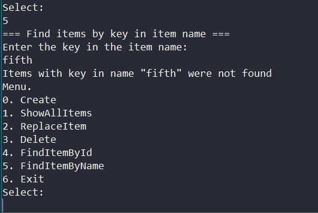

# job4j_tracker
#### Консольное приложение "Система заявок - Трекер"
[](https://app.travis-ci.com/MasterMaxTs/project_console-tracker)
[](https://codecov.io/gh/MasterMaxTs/job4j_tracker)


&nbsp;&nbsp;&nbsp;<br>
&nbsp;&nbsp;&nbsp;<br>
&nbsp;&nbsp;&nbsp;<br>
&nbsp;&nbsp;&nbsp;<br>
&nbsp;&nbsp;&nbsp;<br>
&nbsp;&nbsp;&nbsp;
&nbsp;&nbsp;&nbsp;
&nbsp;&nbsp;&nbsp;
&nbsp;&nbsp;&nbsp;
&nbsp;&nbsp;&nbsp;<br>
&nbsp;&nbsp;&nbsp;
&nbsp;&nbsp;&nbsp;
&nbsp;&nbsp;&nbsp;<br>
&nbsp;&nbsp;&nbsp;
&nbsp;&nbsp;&nbsp;
&nbsp;&nbsp;&nbsp;
&nbsp;&nbsp;&nbsp;<br><br>
&nbsp;&nbsp;&nbsp;


### Это проект по разработке консольного приложения "Система заявок - трекер".

___
### Требуемый функционал.

1. <b> В приложении ведётся работа с заявками </b>


2. <b> Заявка имеет характеристики: </b>
   
   - уникальный номер-идентификатор ID
   - название
   - время создания
   - описание


3. <b>Пользователю в консоле приложения отображается меню с возможностями программы:</b>

   - добавление заявки
   - замена заявки на новую заявку по ID
   - удаление заявки по ID
   - отображение списка всех заявок
   - поиск заявки по ID
   - поиск списка заявок по совпадению в названии
   - выход из приложения


---
### Стек технологий

- Java 11
- Maven 3.6.3
- Hibernate-core v.5.6.10.Final
- Lombok v.1.18.24
- Slf4j-log4j12 v.2.0.5
- Docker v.24.0.6
- Docker Compose v.1.28.6
- СУБД: PostgreSQL v.14.0.
  <br><br>
- Тестирование:
    - JUnit v.4.12
    - Hamcrest v.1.3
    - Mockito-core v.4.6.1
    - БД: h2database v.2.1.214

<br>

- Упаковка проекта: Java Archive (.jar)

---
### Требования к окружению
- Java 11
- Maven v.3.6.3
- PostgreSQL v.14.0

<br>

---
### Запуск проекта

#### <ins>Развёртывание приложения с помощью Docker (ОС Linux):</ins>

1. Проверить, установлен ли Docker:
    - терминал<br>
      ```docker --version```
    - если не установлен, установить


2. Проверить, установлен ли Docker Compose:
    - терминал<br>
      ```docker-compose --version```
    - если не установлен, установить


3. Скачать файлы проекта с github по ссылке и разархивировать в выбранную директорию проекта:<br>
   [https://github.com/MasterMaxTs/project_console-tracker/archive](https://github.com/MasterMaxTs/project_console-tracker/archive/refs/heads/master.zip)


4. Открыть терминал, перейти в директорию проекта:<br>
    - Для <ins>первого</ins> развёртывания и запуска приложения выполнить последовательно команды:
        - ```doсker-compose build```
        - ```docker-compose up -d db```
        - ```docker-compose run job4j_tracker```

    - Для <ins>последующего</ins> запуска приложения выполнять последовательно команды:
        - ```docker-compose up -d db```
        - ```docker-compose run job4j_tracker```

<br>

#### <ins>Запуск приложения локально:</ins>
1. Установить СУБД PostgreSQL


2. Создать базу данных с именем url_shortcuter:<br>
   ```create database tracker;```


3. Скачать файлы проекта с github по ссылке и разархивировать в выбранную директорию:<br>
   [https://github.com/MasterMaxTs/project_console-tracker/archive](https://github.com/MasterMaxTs/project_console-tracker/archive/refs/heads/master.zip)


4. Перейти в директорию проекта, открыть командную строку.</br>
- Для <ins>первого</ins> запуска приложения выполнить последовательно команды:
    - ```mvn package -Pproduction -Dmaven.test.skip=true```
    - ```java -jar target/console_tracker.jar```

- Для <ins>последующего</ins> запуска приложения выполнять команду:
    - ```java -jar target/console_tracker.jar```


---
### Закрытие проекта

#### <ins>Закрытие в Docker:</ins>
- Выйти из приложения, используя меню, далее терминале выполнить команду:
    - ```docker-compose stop```

<br>

#### <ins>Закрытие локально:</ins>
- Закройте окно командной строки

<br>

---
### Взаимодействие с приложением
<br>

1. Основной вид в консоли при запуске приложения:<br><br>
   


2. Вид консоли приложения при создании заявки:<br><br>
   


3. Вид консоли приложения при отображении всех заявок:<br><br>
   


4. Вид консоли приложения при успешном замещении заявки:<br><br>
   


5. Вид консоли приложения при попытке замещения не существующей заявки:<br><br>
   


6. Вид консоли приложения при успешном удалении заявки:<br><br>
   


7. Вид консоли приложения при удалении не существующей заявки:<br><br>
   


8. Вид консоли приложения при успешном нахождении заявки по ID:<br><br>
   


9. Вид консоли приложения при попытке нахождения не существующей заявки:<br><br>
   


10. Вид консоли приложения при успешном нахождении списка заявок по ключу в названии:<br><br>
   


11. Вид консоли приложения при нахождении списка заявок по ключу в названии, когда поиск не вернул данных:<br><br>
   


12. Вид консоли приложения, когда введённые пользователем данные не валидны:<br><br>
   


13. Вид консоли приложения при завершении приложения:<br><br>
    


---
### Особенности технической реализации учебного проекта

<br>

- В проекте ипользуются три реализации хранилища заявок:

| Класс                     | Описание                                    |
|:--------------------------|:--------------------------------------------|
  | . / trackers / MemTracker | реализация в памяти                         |
  | . / trackers / HbmTracker | реализация в БД, доступ с помощью Hibernate |
  | . / trackers / SqlTracker | реализация в БД, доступ с помощью Jdbc      |


<br>

- <b> В проекте настроено три профиля сборки:</b>

    - docker&emsp;&emsp;&emsp;: &emsp;развёртывание с помощью Docker Compose;
    - production&emsp;&nbsp;: &emsp;запуск приложения локально;
    - test&emsp;&emsp;&emsp;&emsp;&nbsp;: &emsp;тестирование приложения в процессе разработки.


___
### Контакты
* Email: java.dev-maxim.tsurkanov@yandex.ru
* Skype: https://join.skype.com/invite/ODADx0IJ3BBu
* VK: https://m.vk.com/id349328153
* Telegram: matsurkanov